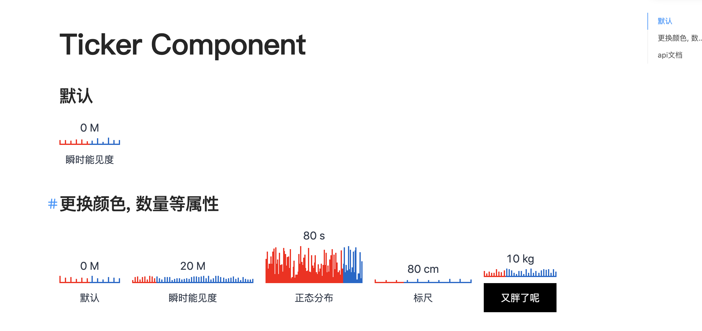

# @umi-material/ticker

一个基于react的轻量级刻度线可视化组件

## 组件截图


## Usage

```sh
umi block https://github.com/https://github.com/MrXujiang/ticker/tree/master/ticker
```

## api文档
| 属性名 | 类型 | 默认值 | 解释 |
|  ----  | ----  | ---- | ---- |
| width | number | 100 |  刻度组件的宽度   |
| maxHeight | number | 10 |  刻度线的最大高度   |
| percent | number | 50 |  当前刻度条的进度,值在0~100之间   |
| text | string | '' |  刻度条组件的文本   |
| value | number | 50 |  刻度组件的当前值   |
| showValue | boolean | true |  是否展示刻度线值  |
| unit | string | '' |  刻度线值的单位   |
| lineNum |number | 12 |  刻度条的数量   |
| defaultColor | string | '#06c' |  刻度线默认颜色   |
| activeColor | string | 'red' |  刻度线激活部分的颜色  |
| textStyle | object | {} |  刻度线文本样式   |
| valueStyle | object | {} |  刻度条值的样式   |

## 技术交流


## LICENSE

MIT
